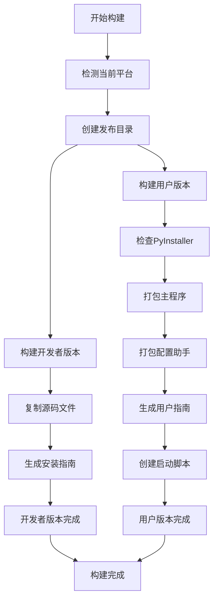

 # 墨问MCP服务器构建系统技术说明

## 概述

本文档详细说明了墨问MCP服务器的跨平台构建系统的技术架构、设计思路和实现细节。

## 技术架构

### 1. 构建系统架构

```
build/
├── build_release.py          # 主构建脚本（Python）
├── build_windows.bat         # Windows平台构建脚本
├── build_macos.sh           # macOS平台构建脚本  
├── build_linux.sh           # Linux平台构建脚本
├── config_helper.py         # 配置助手源码
├── 配置助手.spec            # PyInstaller配置文件
└── BUILD_TECHNICAL_GUIDE.md # 本技术说明文档
```

### 2. 核心组件

#### 2.1 CrossPlatformBuilder 类
- **职责**: 统一管理跨平台构建流程
- **核心方法**:
  - `build_all_platforms()`: 自动检测当前平台并构建
  - `build_platform(target_platform)`: 构建指定平台版本
  - `build_developer_version()`: 构建开发者版本（源码包）
  - `build_user_version()`: 构建用户版本（可执行文件）

#### 2.2 平台配置系统
```python
platform_configs = {
    'windows': {
        'exe_suffix': '.exe',
        'pyinstaller_args': ['--console'],
        'config_helper_args': ['--windowed'],
        'main_name': 'mowen-mcp-server.exe',
        'config_name': '配置助手.exe'
    },
    'darwin': {  # macOS
        'exe_suffix': '',
        'pyinstaller_args': ['--console'],
        'config_helper_args': ['--windowed'],
        'main_name': 'mowen-mcp-server',
        'config_name': '配置助手.app'
    },
    'linux': {
        'exe_suffix': '',
        'pyinstaller_args': ['--console'],
        'config_helper_args': ['--windowed'],
        'main_name': 'mowen-mcp-server',
        'config_name': '配置助手'
    }
}
```

## 技术实现细节

### 1. 双版本构建策略

#### 1.1 开发者版本 (Developer Version)
- **目标用户**: 开发者、高级用户
- **内容**: 完整源码 + 依赖管理文件
- **优势**: 
  - 可自定义修改
  - 支持调试
  - 体积小（无需打包依赖）
- **文件结构**:
  ```
  developer-version/
  ├── src/                    # 源码目录
  ├── scripts/               # 辅助脚本
  ├── pyproject.toml         # 项目配置
  ├── README.md              # 说明文档
  ├── LICENSE                # 许可证
  ├── env.example            # 环境变量示例
  └── INSTALL_GUIDE.md       # 安装指南
  ```

#### 1.2 用户版本 (User Version)
- **目标用户**: 普通用户、非技术用户
- **内容**: 预编译可执行文件 + 配置工具
- **优势**:
  - 开箱即用
  - 无需Python环境
  - 包含图形化配置工具
- **文件结构**:
  ```
  user-version/
  ├── mowen-mcp-server(.exe)  # 主程序
  ├── 配置助手(.exe/.app)     # 配置工具
  ├── USER_GUIDE.md          # 用户指南
  ├── start_server(.bat/.sh) # 启动脚本
  └── README.txt             # 快速说明
  ```

### 2. PyInstaller 打包策略

#### 2.1 主程序打包
```python
cmd = [
    "pyinstaller",
    "--onefile",              # 单文件模式
    "--name", "mowen-mcp-server",
    "--clean",                # 清理缓存
    "--noconfirm",           # 不确认覆盖
    "--console"              # 保留控制台（便于调试）
]
```

**技术考量**:
- **单文件模式**: 简化分发，避免依赖文件丢失
- **保留控制台**: MCP服务器需要输出日志信息
- **清理构建**: 确保每次构建的一致性

#### 2.2 配置助手打包
```python
cmd = [
    "pyinstaller",
    "--onefile",
    "--name", "配置助手",
    "--windowed",            # GUI应用，隐藏控制台
    "--clean",
    "--noconfirm"
]
```

**技术考量**:
- **窗口模式**: GUI应用不需要控制台
- **中文名称**: 提升用户体验
- **独立打包**: 与主程序分离，降低复杂度

### 3. 跨平台兼容性处理

#### 3.1 路径处理
```python
# 自动检测平台并标准化路径
if target_platform != 'windows':
    exe_path = exe_path.replace('\\', '/')
```

#### 3.2 权限处理
```python
# macOS/Linux需要设置执行权限
if target_platform in ['macos', 'linux']:
    os.chmod(user_dir / target_name, 0o755)
```

#### 3.3 平台检测
```python
self.current_platform = platform.system().lower()
# 'windows' -> Windows
# 'darwin' -> macOS  
# 'linux' -> Linux
```

### 4. 配置助手技术实现

#### 4.1 GUI框架选择
- **技术选型**: Tkinter
- **原因**: 
  - Python标准库，无额外依赖
  - 跨平台兼容性好
  - 打包后体积小

#### 4.2 平台自适应
```python
# 自动检测平台
system = platform.system().lower()
if system == 'darwin':
    self.target_platform = 'macos'
elif system == 'windows':
    self.target_platform = 'windows'
else:
    self.target_platform = 'linux'
```

#### 4.3 可执行文件路径检测
```python
if hasattr(sys, '_MEIPASS'):
    # PyInstaller打包环境
    if sys.platform == 'darwin':
        # macOS .app包的特殊处理
        self.exe_dir = os.path.dirname(sys.executable)
        if '.app' in self.exe_dir:
            # 从.app/Contents/MacOS回到.app同级目录
            self.exe_dir = os.path.dirname(os.path.dirname(os.path.dirname(self.exe_dir)))
    else:
        self.exe_dir = os.path.dirname(sys.executable)
else:
    # 开发环境
    self.exe_dir = os.path.dirname(os.path.abspath(__file__))
```

## 构建流程

### 1. 构建流程图



### 2. 详细步骤

#### 步骤1: 环境准备
1. 检测当前操作系统
2. 验证Python环境
3. 安装PyInstaller（如需要）
4. 清理旧的构建文件

#### 步骤2: 开发者版本构建
1. 创建目标目录
2. 复制源码文件（src/, scripts/）
3. 复制配置文件（pyproject.toml, README.md等）
4. 生成平台特定的安装指南

#### 步骤3: 用户版本构建
1. 使用PyInstaller打包主程序
2. 使用PyInstaller打包配置助手
3. 复制可执行文件到目标目录
4. 设置文件权限（Unix系统）
5. 生成用户指南和启动脚本

#### 步骤4: 后处理
1. 清理临时文件
2. 验证构建结果
3. 生成构建报告

## 错误处理与调试

### 1. 常见问题

#### 1.1 PyInstaller打包失败
- **原因**: 缺少依赖、路径问题、权限不足
- **解决**: 检查依赖安装、使用绝对路径、提升权限

#### 1.2 跨平台路径问题
- **原因**: Windows使用反斜杠，Unix使用正斜杠
- **解决**: 统一使用Path对象或标准化路径

#### 1.3 macOS权限问题
- **原因**: 可执行文件缺少执行权限
- **解决**: 使用chmod设置755权限

### 2. 调试技巧

#### 2.1 启用详细输出
```python
# 在PyInstaller命令中添加
"--debug", "all"
```

#### 2.2 保留构建文件
```python
# 注释掉清理代码进行调试
# self.cleanup()
```

#### 2.3 分步构建
```python
# 单独测试各个组件
self.build_main_executable(user_dir, target_platform)
# self.build_config_helper(user_dir, target_platform)
```

## 扩展与维护

### 1. 添加新平台支持

1. 在`platform_configs`中添加平台配置
2. 更新平台检测逻辑
3. 添加平台特定的处理逻辑
4. 创建对应的构建脚本

### 2. 优化构建性能

1. **并行构建**: 同时构建多个组件
2. **增量构建**: 只重新构建变更的部分
3. **缓存机制**: 缓存PyInstaller构建结果

### 3. 质量保证

1. **自动化测试**: 构建后自动测试可执行文件
2. **版本管理**: 自动生成版本号和变更日志
3. **签名验证**: 为可执行文件添加数字签名

## 最佳实践

### 1. 构建环境
- 使用干净的虚拟环境
- 固定依赖版本
- 定期更新构建工具

### 2. 版本管理
- 使用语义化版本号
- 维护详细的变更日志
- 标记重要的里程碑版本

### 3. 分发策略
- 提供多种安装方式
- 明确的系统要求说明
- 完善的用户文档

## 总结

墨问MCP服务器的构建系统采用了模块化、跨平台的设计理念，通过Python脚本统一管理构建流程，使用PyInstaller进行可执行文件打包，并提供了开发者版本和用户版本两种分发方式。

系统的核心优势：
1. **跨平台兼容**: 支持Windows、macOS、Linux
2. **双版本策略**: 满足不同用户群体需求
3. **自动化构建**: 减少人工干预和错误
4. **模块化设计**: 易于扩展和维护
5. **用户友好**: 提供图形化配置工具

通过这套构建系统，可以高效地为不同平台的用户提供稳定、易用的墨问MCP服务器程序。